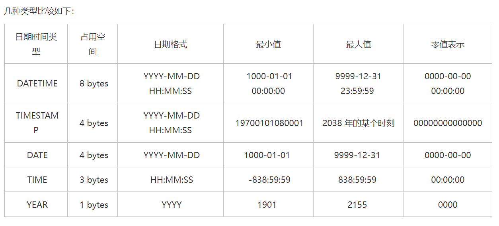

Java、mysql、html date转换问题

数据库日期格式为datetime  yyyy-MM-dd HH:mm:ss

```java
error:
Failed to convert property value of type 'java.lang.String' to required type 'java.util.Date' for property 'hireDate'
```

- 解决:

  ```
  /**前台到后台*/
  @DateTimeFormat(pattern = "yyyy-MM-dd")
  pojo日期注解。
  html 输入标签直接写date 或 datetime-local（格式要对应DateTimeFormat的格式）
  ```

### java.util.Date 

Date类型 [Date和Calendar - 廖雪峰的官方网站 (liaoxuefeng.com)](https://www.liaoxuefeng.com/wiki/1252599548343744/1303791989162017)

```java
public class Main {
    public static void main(String[] args) {
        // 获取当前时间:
        Date date = new Date();
        var sdf = new SimpleDateFormat("yyyy-MM-dd HH:mm:ss");
        System.out.println(sdf.format(date));
    }
}
```

可以用SimpleDateFormat进行格式转换 传值到mysql中

### mysql日期类型



### HTML

```html
<input id="date" type="date"> 
格式:YYYY-MM-DD 
<input type="time" id="startTime">
格式：HH:mm
<input id="party" type="datetime-local" name="partydate">
格式：YYYY-MM-DD HH:mm
```

前台是通过html将时间（字符串形式）传到Java，Java传到mysql。

字符串 到JavaDate 类型 到数据库Date类型。

所以格式需要一一对应才会成功。

参考：[(41条消息) 关于Date，与html中Date，数据库（mysql）Date，以及Java（Date）的关系与使用_c17315377559的博客-CSDN博客](https://blog.csdn.net/c17315377559/article/details/89601363)

（ps:有错再改）

### @DateTimeFormat与@JsonFormat

```
/**前台到后台*/
@DateTimeFormat(pattern = "yyyy-MM-dd")
/**后台到前台*/
@JsonFormat(pattern = "yyyy-MM-dd")
```

详解：[@JsonFormat与@DateTimeFormat注解的使用 - zhuzhipeng - 博客园 (cnblogs.com)](https://www.cnblogs.com/mracale/p/9828346.html)

